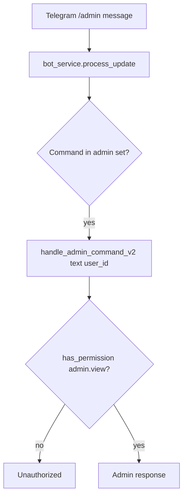
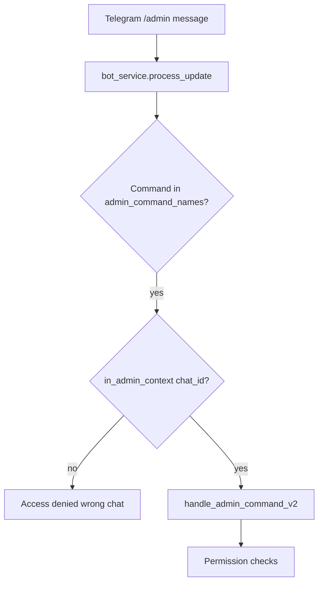
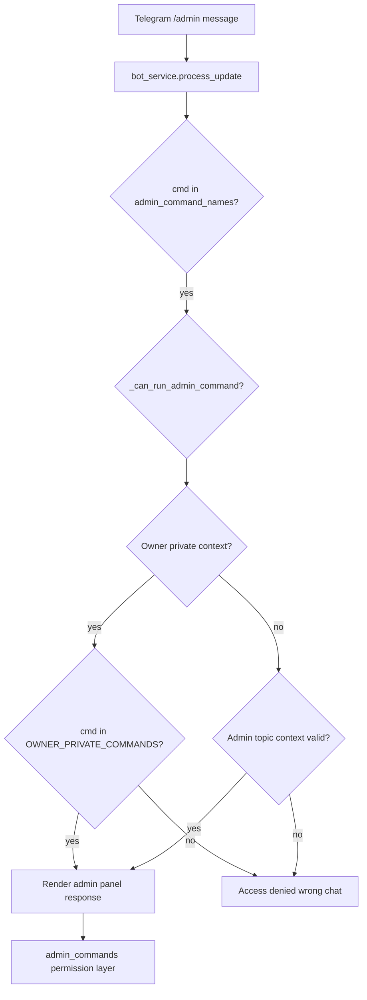
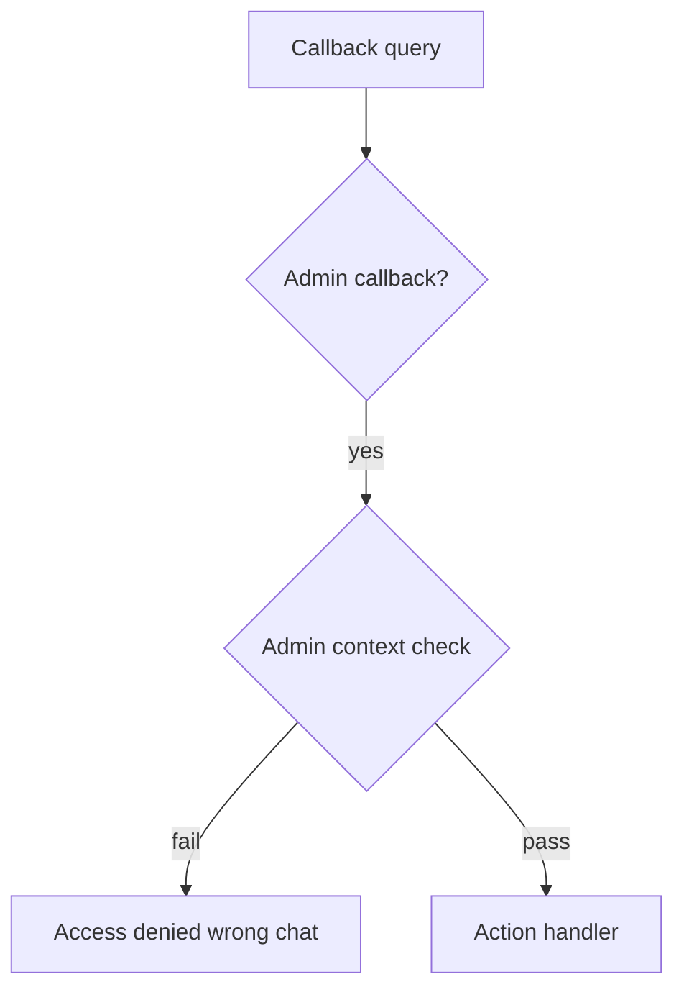

# AUTH_FLOW_DIAGRAM

## 1) Hetzner-era effective slash `/admin` flow (pre-49aaeb4)

Evidence:
- `0fb9112:send/core/bot_service.py:548-556`
- `d7e7213:send/core/bot_service.py:156-168`
- `send/core/admin_commands.py` + `send/core/admin_permissions.py`

---

## 2) 49aaeb4 hardened flow that introduced wrong-chat slash denial

Evidence:
- `49aaeb4:send/core/bot_service.py:239-243`

---

## 3) Current canonical flow (64345ae+)

Evidence:
- `send/core/bot_service.py:40-52,78-105,398-404`

---

## 4) Callback/admin-panel context flow (historical and current)

Notes:
- Legacy callback context checks existed already in imported Hetzner snapshot (`0fb9112:275-281`).
- BATCH-05 made context default fail-closed when `ADMIN_CONTROL_CHAT_ID` missing (`d7e7213:34-40`).
- Current uses topic-aware context for callbacks (`send/core/bot_service.py:90-99,358-363`).
